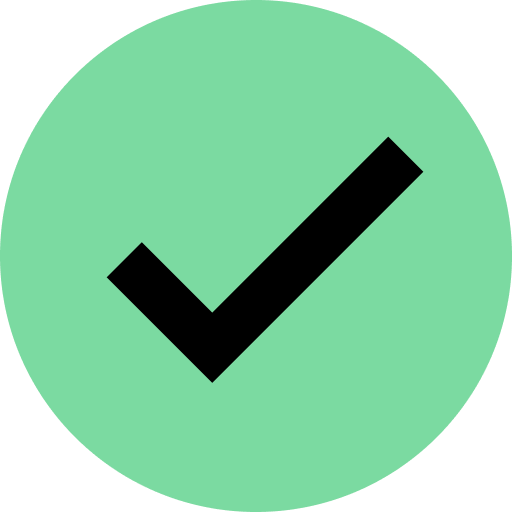

# Decommissioned: This repo and the website are no longer updated


<h1 align="center">
    </br>
  Out of Lockdown
</h1>

<div align="center">
  View vaccination rates for each District Health Board (DHB) in New Zealand and track daily progress towards the 90% goal, enabling Kiwis to get out of lockdown.
  <br />
  <br />
  <a href="https://github.com/theramis/aucvid/issues/new?assignees=&labels=bug&template=bug_report.md&title=%F0%9F%90%9B%20Bug:%20">Report a Bug</a>
  ·
  <a href="https://github.com/theramis/aucvid/issues/new?assignees=&labels=enhancement&template=feature_request.md&title=%F0%9F%92%A1%20Feature:%20">Request a Feature</a>
</div>
<div align="center">
<br />

[](../LICENSE)
[](https://app.netlify.com/sites/aucvid-site/deploys)

</div>

## ⚡️ Quickstart

### Prerequisites

This project requires NodeJs 14.18.1.
We suggest using [nvm](https://github.com/nvm-sh/nvm) or [fnm](https://fnm.vercel.app) to install the correct version.

You can also download the binaries from the official source [here](https://nodejs.org/download/release/v14.18.1/)

> Note we are restricted to use NodeJS 14.18.1 as we use netlify which uses AWS Lambdas to host our application. The latest NodeJs version AWS Lambda currently supports is 14.18.1.

### Running it locally

```bash
# install all of the dependencies
npm i

# run the development server
npm run dev
```

Open [http://localhost:3000](http://localhost:3000) with your browser to see the result.

#### Learn More

This project uses Next.js take a look at the following resources to learn more about it:

- [Next.js Documentation](https://nextjs.org/docs) - learn about Next.js features and API.
- [Learn Next.js](https://nextjs.org/learn) - an interactive Next.js tutorial.
